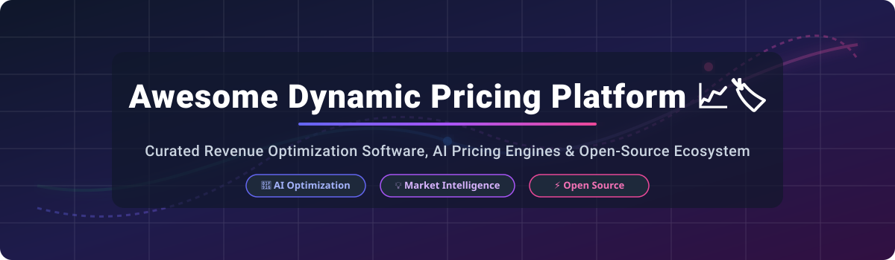
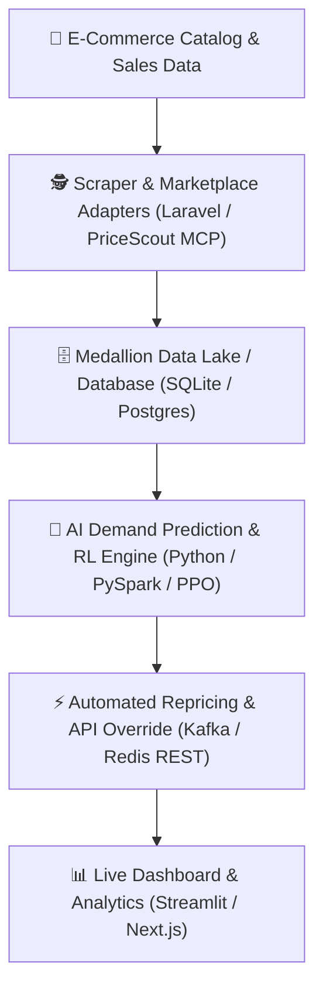

# Awesome Dynamic Pricing Platform 📈🏷️

  

  
  
  
  
  

---

## 📌 Ecosystem Overview & SEO Keywords

Welcome to the **Awesome Dynamic Pricing Platform** repository — the ultimate curated guide to enterprise **SaaS revenue management**, **AI dynamic pricing engines**, **retail repricing algorithms**, and **open-source competitive price intelligence tools**. 

Whether you are a retail technologist, pricing analyst, e-commerce founder, or machine learning engineer, this repository tracks solutions that enable real-time price optimization based on demand elasticity, competitor monitoring, inventory depth, and customer behavior.

---

## 📊 Market Overview & Industry Structure

> 💡 **Estimated Market Size**: The global Dynamic Pricing & Price Optimization Software market size was estimated at **~$3.2 Billion in 2024** and is projected to expand at a **CAGR of ~16.4%**, reaching over **~$8.5 Billion by 2030**.
>
> 🌐 **Market Dynamics**: The market is **moderately fragmented**. While legacy B2B pricing leaders (*PROS*, *Pricefx*, *Zilliant*) command enterprise manufacturing and distribution contracts, specialized retail repricers (*Competera*, *Omnia Retail*, *Revionics*) and emerging AI-agent pricing setups operate competitively across e-commerce niches. It is **not a winner-take-all market**, owing to distinct vertical requirements (e.g., airline revenue management vs. high-SKU e-commerce repricing).

---

## 🏢 Enterprise SaaS & Hosted Platforms

The table below details commercial dynamic pricing platforms, sorted by **company scale (Annual Revenue / Financial Footprint)** in descending order.

| Platform Name 🏢 | Pricing Tier (Starting) 💵 | Free Tier / Free Trial Limit 🎁 | Scale (Revenue / Valuation) 📈 | Key Capabilities & Target Verticals 🎯 |
| :--- | :--- | :--- | :--- | :--- |
| **[PROS Pricing](https://www.pros.com/)** 🚀 | **~$100,000/year** (Enterprise deployment quote) | ❌ No free tier/trial (Custom interactive demo upon sales qualification) | **~$351.7M ARR** (Public: NYSE `PRO`, Enterprise Value ~$939.5M) | AI-powered B2B price guidance, deal optimization, CPQ integration & airline revenue management. |
| **[Pricefx](https://www.pricefx.com/)** 💎 | **~$100,000/year** (Subscription + integration tiers) | ❌ No free tier/trial (Requires consultative enterprise demo) | **~$80M–$100M ARR** (Growth-stage cloud leader, ~$130M total funding) | Cloud-native pricing management, margin analytics, rebating, and price setting for B2B & B2C. |
| **[Revionics](https://revionics.com/)** 🛒 | **~$50,000/year** (Enterprise catalog quota) | ❌ No free tier/trial (Live guided demo only) | **~$39.1M ARR** (Acquired by Aptos, $56.8M total funding) | AI retail price optimization, promotional effectiveness, markdown planning & customer elasticity modeling. |
| **[Zilliant](https://www.zilliant.com/)** 📊 | **~$50,000/year** (Custom annual SaaS contract) | ❌ No free tier/trial (Request-a-demo model) | **~$37.8M ARR** (Private equity backed by Madison Dearborn Partners, ~$101M funding) | B2B price optimization, deal management, margin defense, and automated CPQ pricing logic. |
| **[Intelligence Node](https://www.intelligencenode.com/)** 🌐 | **~$1,500/month** (Growth catalog pricing) | ❌ No free tier/trial (Free custom data audit demo) | **~$15.2M ARR** (Series C funded, ~$30M total funding) | Real-time retail competitive price tracking, AI product matching & automated repricing rules. |
| **[Competera](https://competera.net/)** 🧠 | **~$1,000/month** (Tiered SKU count quote) | ❌ No free tier/trial (Multi-quarter pilot setup with proof-of-concept) | **~$14.0M ARR** (Venture-backed AI startup, $3M seed round) | Deep learning demand forecasting, price recommendation engine & multi-channel retail repricing. |
| **[Quicklizard](https://www.quicklizard.com/)** 🦎 | **~$500/month** (Tiered SKU & update frequency) | ❌ No free tier/trial (14-day request demo) | **~$6.7M ARR** (Publicly listed on TASE: `QLZR`) | Dynamic pricing engine for omni-channel retail, market rate monitoring & automated price rules. |
| **[Omnia Retail](https://www.omniaretail.com/)** 🛍️ | **€399/month** (~$435/mo for SMB base tier) | ❌ No free trial (1-on-1 personalized strategy demo) | **~$2.4M ARR** (Private bootstrapped/growth SaaS) | Self-serve to enterprise price automation, competitor web scraping & elasticity repricing. |
| **[BlackCurve](https://www.blackcurve.com/)** 📈 | **£250/month** (~$330/mo standard package) | ❌ No free tier/trial (30-day guided onboarding demo) | **Private (<$5M ARR)** (UK venture-backed) | E-commerce pricing rules engine, Google Shopping competitor tracking & margin defense logic. |
| **[PriceEdge](https://www.priceedge.com/)** 🏷️ | **~$400/month** (Essential SaaS plan) | ❌ No free tier/trial (Free platform preview session) | **Private (<$5M ARR)** (Scandinavian pricing software startup) | Flexible price management framework, price elasticity rules & multi-currency price publishing. |

---

## ⚡ Open-Source GitHub Projects

Below are top active open-source projects, frameworks, and AI research implementations for dynamic pricing, price monitoring, and reinforcement learning simulations — sorted by **GitHub Stars_Count** (descending).

| Project Name 💻 | GitHub Stars_Count ⭐ | Primary Tech Stack 🛠️ | Description & Architecture Highlights 🔍 |
| :--- | :--- | :--- | :--- |
| **[awesome-dynamic-pricing](https://github.com/DallasBuyer/awesome-dynamic-pricing)** 📚 |  | Markdown / Curated List | Comprehensive research compilation of dynamic pricing papers, elasticity models, and algorithmic references. |
| **[Dynamic Pricing Recommendation System](https://github.com/hemangsharma/dynamic-pricing)** 🤖 |  | Python, PySpark, Streamlit, RL | ML recommendation system utilizing local competition data, seasonal weather APIs, Streamlit GUI, and PySpark pipeline. |
| **[AI Dynamic Pricing Simulator](https://github.com/VirajBarapatre/dynamic-pricing-simulator)** 🎮 |  | Python, Flask, TailwindCSS, Chart.js | AI simulator predicting demand, revenue, and profit curves using Random Forest models across synthetic retail datasets. |
| **[STAD-GCN](https://github.com/ksd1221/STADGCN)** 🔮 |  | PyTorch, Python, GCN | Spatial-Temporal Attention Dynamic Graph Convolutional Network for market price prediction (ESWA 2024 paper). |
| **[Prediction-based One-shot Parking Pricing](https://github.com/seoyoungh/one-shot-optimization)** 🅿️ |  | Python, Jupyter Notebook | CIKM 2022 accepted paper implementation focusing on dynamic parking pricing via one-shot prediction-optimization models. |
| **[Laravel AI Price Intelligence](https://github.com/padosoft/laravel-ai-price-intelligence)** 🐘 |  | PHP, Laravel, AI, Webhooks | Enterprise product price intelligence package featuring Amazon/eBay marketplace adapters, anomaly detection, and repricer rules. |
| **[Price Monitoring System (Free)](https://github.com/spinov001-art/price-monitoring-free)** 🕵️ |  | Node.js, JSON-LD, Sitemap Parser | Zero-cost competitor monitoring pipeline with JSON-LD parsing, GitHub versioned storage, and automated webhook alerts. |
| **[Calyber Q-Learning Pricing Engine](https://github.com/MalcolmZhao/Calyber_QLearning)** 🧠 |  | Python, Q-Learning | Reinforcement learning decision-making framework optimizing price adaptation in simulated duopoly environments. |
| **[Dynamic Pricing Ride Fares App](https://github.com/roissyahf/Dynamic-Pricing-Ride-Fares-App)** 🚗 |  | JavaScript, React, Node.js | Surge pricing application adjusting ride-sharing costs dynamically based on driver supply and rider demand density. |
| **[AI-Driven Dynamic Pricing Model (ATO)](https://github.com/giorgio-bono/AI-Driven-Dynamic-Pricing-Model)** ⚙️ |  | Python, Gurobi, Monte Carlo | Assemble-to-Order (ATO) stochastic demand optimization integrating Monte Carlo simulation and Response Surface Methodology. |

---

## 🛠️ Architecture Recommendation for Custom Building

---

## 💖 Support & Sponsorship

Thank you for exploring and using the **Awesome Dynamic Pricing Platform** ecosystem! 

If you find this repository helpful for your research, product development, or pricing strategies, please consider supporting the project:

- 🌟 **Star this repository** to help others discover it!
- 🍴 **Fork it** to contribute new platforms, algorithms, or papers.
- 📢 **Share it** with your network, colleagues, or engineering teams.
- ☕ **Sponsor / Buy a coffee**: Help maintain and expand open-source pricing resources by visiting the [Sponsor Dashboard](https://github.com/sponsors/ishandutta2007).

---

## 🤝 How to Contribute

1. Fork this repository 🍴
2. Add or update entries in `README.md` following the established table structure 📝
3. Verify that SaaS pricing details or open-source Stars_Badges are accurate 🎯
4. Create a Pull Request with a clear description 🚀

---

## ⚖️ Legal Disclaimer

- This directory is **community-curated** for informational and research purposes only.
- Dynamic pricing systems must strictly abide by antitrust laws, consumer transparency rules, and prohibitions against algorithmic price-fixing or collusion.

---

## 📈 Star History

---

  <b>Made with ❤️ for Pricing Analysts, Data Scientists, Revenue Managers, and Retail Engineers.</b>

